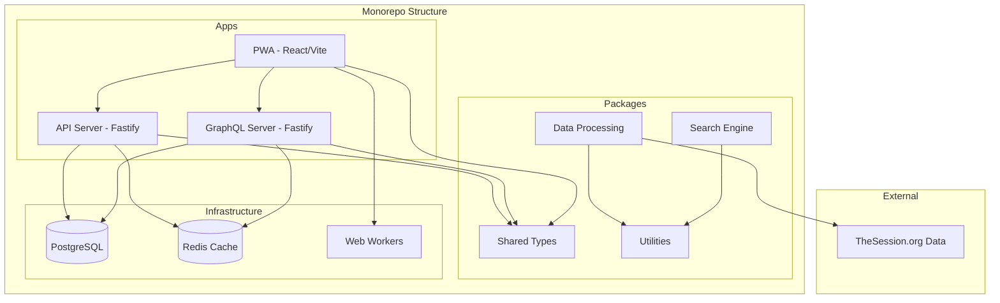

# Design Document

## Overview

Tunebook is designed as a modern monorepo architecture that provides a comprehensive platform for exploring Irish music resources. The system follows a microservices approach with shared libraries, containerized services, and a Progressive Web App frontend. The architecture emphasizes performance, scalability, and developer experience through modern tooling and best practices.

The design is compatible with modern backend-as-a-service platforms like Convex, allowing for flexible deployment options while maintaining the core architecture principles.

## Architecture

### High-Level Architecture



### Monorepo Structure

```
tunebook/
├── apps/
│   ├── pwa/                    # React TypeScript PWA
│   ├── api-server/             # REST API with Fastify
│   └── graphql-server/         # GraphQL API with Fastify
├── packages/
│   ├── shared-types/           # TypeScript definitions
│   ├── data-processing/        # Data normalization & ETL
│   ├── search-engine/          # Fuzzy search implementation
│   └── utils/                  # Common utilities
├── infrastructure/
│   ├── docker/                 # Docker configurations
│   └── database/               # Database schemas & migrations
├── tools/
│   └── scripts/                # Build and deployment scripts
└── docs/                       # Documentation
```

## Components and Interfaces

### 1. Progressive Web App (PWA)

**Technology Stack:**

- React 18 with TypeScript
- Vite for build tooling and dev server
- React Query for data fetching and caching
- Workbox for service worker and offline capabilities
- Fuse.js for client-side fuzzy search
- React Router for navigation
- Tailwind CSS for styling

**Key Features:**

- Offline-first architecture with service worker
- Local data caching using IndexedDB
- Web Workers for data processing
- Responsive design for mobile and desktop
- Progressive enhancement

**Interface Design:**

```typescript
interface TuneSearchInterface {
  searchTunes(query: string, filters?: SearchFilters): Promise<Tune[]>;
  filterByType(type: TuneType): Promise<Tune[]>;
  sortBy(criteria: SortCriteria): Promise<Tune[]>;
  getCrossReferences(tuneId: string): Promise<CrossReference[]>;
}

interface DataSyncInterface {
  syncData(): Promise<SyncResult>;
  getLastSyncTime(): Date;
  isOfflineMode(): boolean;
}
```

### 2. API Server (Fastify)

**Technology Stack:**

- Fastify framework for high performance
- TypeScript for type safety
- Prisma ORM for database operations
- Redis for caching
- Zod for request validation
- JWT for authentication (future)

**API Endpoints:**

```typescript
// REST API Design
GET    /api/tunes              # List tunes with pagination
GET    /api/tunes/:id          # Get specific tune
GET    /api/tunes/search       # Search tunes
GET    /api/albums             # List albums
GET    /api/albums/:id         # Get specific album
GET    /api/stats/popular      # Get popularity statistics
GET    /api/cross-refs/:id     # Get cross-references
POST   /api/data/sync          # Trigger data synchronization
```

### 3. GraphQL Server

**Technology Stack:**

- Fastify with mercurius (GraphQL plugin)
- TypeScript with type-graphql
- DataLoader for efficient data fetching
- Redis for query caching

**Schema Design:**

```graphql
type Tune {
  id: ID!
  name: String!
  type: TuneType!
  key: String
  mode: String
  popularity: Int!
  albums: [Album!]!
  crossReferences: [Tune!]!
  metadata: JSON
}

type Album {
  id: ID!
  name: String!
  artist: String
  tunes: [Tune!]!
  releaseDate: String
}

type Query {
  tunes(
    search: String
    type: TuneType
    sortBy: SortCriteria
    limit: Int
    offset: Int
  ): [Tune!]!

  tune(id: ID!): Tune
  albums(limit: Int, offset: Int): [Album!]!
  popularTunes(limit: Int): [Tune!]!
  crossReferences(tuneId: ID!): [Tune!]!
}
```

### 4. Data Processing Package

**Responsibilities:**

- ETL pipeline for TheSession.org data
- Data normalization and cleaning
- Entity relationship extraction
- Popularity calculation algorithms

**Interface:**

```typescript
interface DataProcessor {
  extractFromSource(source: DataSource): Promise<RawData>;
  normalizeEntities(rawData: RawData): Promise<NormalizedData>;
  calculatePopularity(tunes: Tune[]): Promise<PopularityMetrics>;
  extractRelationships(data: NormalizedData): Promise<Relationship[]>;
}
```

### 5. Search Engine Package

**Technology Stack:**

- Fuse.js for fuzzy search
- Custom indexing for performance
- Web Workers support for background processing

**Interface:**

```typescript
interface SearchEngine {
  indexData(data: SearchableData): Promise<void>;
  search(query: string, options: SearchOptions): Promise<SearchResult[]>;
  suggest(partial: string): Promise<string[]>;
  filter(criteria: FilterCriteria): Promise<SearchResult[]>;
}
```

## Data Models

### Core Entities

```typescript
// Shared Types Package
interface Tune {
  id: string;
  name: string;
  type: TuneType;
  key?: string;
  mode?: string;
  popularity: number;
  albumAppearances: number;
  sessionAppearances: number;
  metadata: Record<string, any>;
  createdAt: Date;
  updatedAt: Date;
}

interface Album {
  id: string;
  name: string;
  artist?: string;
  releaseDate?: string;
  tuneIds: string[];
  metadata: Record<string, any>;
  createdAt: Date;
  updatedAt: Date;
}

interface CrossReference {
  fromTuneId: string;
  toTuneId: string;
  relationshipType: RelationshipType;
  strength: number;
}

enum TuneType {
  JIG = "jig",
  REEL = "reel",
  HORNPIPE = "hornpipe",
  POLKA = "polka",
  WALTZ = "waltz",
  MARCH = "march",
  AIR = "air",
  SLIP_JIG = "slip_jig",
  STRATHSPEY = "strathspey",
}

enum RelationshipType {
  SAME_ALBUM = "same_album",
  SAME_SESSION = "same_session",
  SIMILAR_NAME = "similar_name",
  SAME_KEY = "same_key",
}
```

### Database Schema (PostgreSQL)

```sql
-- Core tables
CREATE TABLE tunes (
  id UUID PRIMARY KEY DEFAULT gen_random_uuid(),
  name VARCHAR(255) NOT NULL,
  type VARCHAR(50) NOT NULL,
  key VARCHAR(10),
  mode VARCHAR(20),
  popularity INTEGER DEFAULT 0,
  album_appearances INTEGER DEFAULT 0,
  session_appearances INTEGER DEFAULT 0,
  metadata JSONB,
  created_at TIMESTAMP DEFAULT NOW(),
  updated_at TIMESTAMP DEFAULT NOW()
);

CREATE TABLE albums (
  id UUID PRIMARY KEY DEFAULT gen_random_uuid(),
  name VARCHAR(255) NOT NULL,
  artist VARCHAR(255),
  release_date DATE,
  metadata JSONB,
  created_at TIMESTAMP DEFAULT NOW(),
  updated_at TIMESTAMP DEFAULT NOW()
);

CREATE TABLE album_tunes (
  album_id UUID REFERENCES albums(id),
  tune_id UUID REFERENCES tunes(id),
  track_number INTEGER,
  PRIMARY KEY (album_id, tune_id)
);

CREATE TABLE cross_references (
  from_tune_id UUID REFERENCES tunes(id),
  to_tune_id UUID REFERENCES tunes(id),
  relationship_type VARCHAR(50) NOT NULL,
  strength DECIMAL(3,2) DEFAULT 1.0,
  PRIMARY KEY (from_tune_id, to_tune_id)
);

-- Indexes for performance
CREATE INDEX idx_tunes_name ON tunes USING gin(to_tsvector('english', name));
CREATE INDEX idx_tunes_type ON tunes(type);
CREATE INDEX idx_tunes_popularity ON tunes(popularity DESC);
CREATE INDEX idx_albums_name ON albums USING gin(to_tsvector('english', name));
```

## Error Handling

### API Error Handling Strategy

```typescript
// Standardized error response format
interface APIError {
  code: string;
  message: string;
  details?: Record<string, any>;
  timestamp: string;
  requestId: string;
}

// Error categories
enum ErrorCode {
  VALIDATION_ERROR = "VALIDATION_ERROR",
  NOT_FOUND = "NOT_FOUND",
  DATA_SYNC_ERROR = "DATA_SYNC_ERROR",
  SEARCH_ERROR = "SEARCH_ERROR",
  DATABASE_ERROR = "DATABASE_ERROR",
  EXTERNAL_API_ERROR = "EXTERNAL_API_ERROR",
}
```

### PWA Error Handling

- Graceful degradation for offline scenarios
- User-friendly error messages
- Retry mechanisms for failed operations
- Fallback to cached data when possible
- Error boundary components for React

### Data Processing Error Handling

- Validation of external data sources
- Partial processing continuation on non-critical errors
- Detailed logging for debugging
- Rollback mechanisms for failed migrations

## Testing Strategy

### Unit Testing

- **Frontend:** Jest + React Testing Library
- **Backend:** Jest + Supertest for API testing
- **Packages:** Jest for utility and business logic testing
- **Coverage Target:** 80% minimum

### Integration Testing

- API endpoint testing with test database
- GraphQL query testing
- Data processing pipeline testing
- Cross-package integration testing

### End-to-End Testing

- Playwright for PWA user flows
- Critical path testing (search, filter, cross-reference)
- Offline functionality testing
- Performance testing under load

### Performance Testing

- Load testing for API endpoints
- Memory usage testing for large datasets
- Search performance benchmarking
- PWA performance audits with Lighthouse

### Testing Infrastructure

```typescript
// Test utilities package
interface TestHelpers {
  createMockTune(overrides?: Partial<Tune>): Tune;
  createMockAlbum(overrides?: Partial<Album>): Album;
  setupTestDatabase(): Promise<void>;
  cleanupTestDatabase(): Promise<void>;
  mockExternalAPIs(): void;
}
```

### Continuous Integration

- GitHub Actions for automated testing
- Parallel test execution across packages
- Docker-based testing environment
- Automated performance regression detection

This design provides a robust, scalable foundation for the Tunebook monorepo that addresses all requirements while maintaining flexibility for future enhancements.
